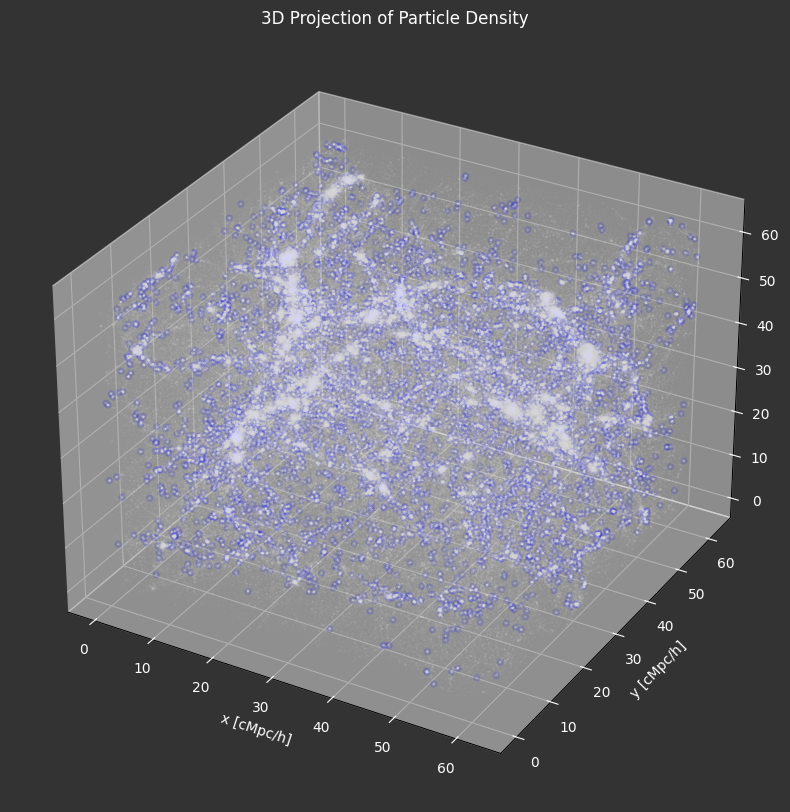
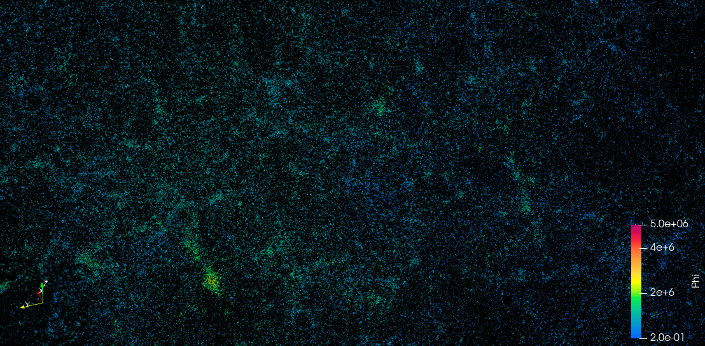
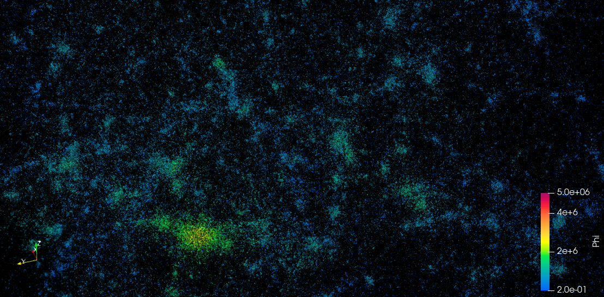
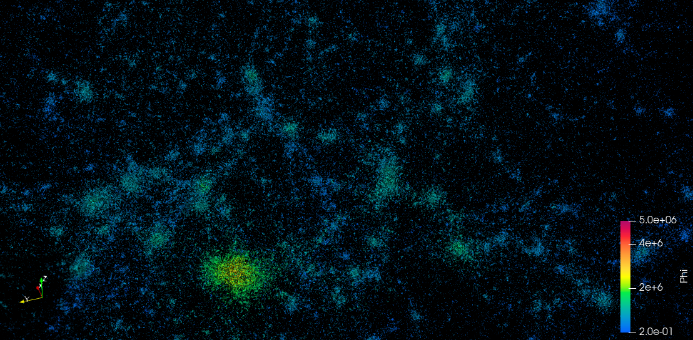
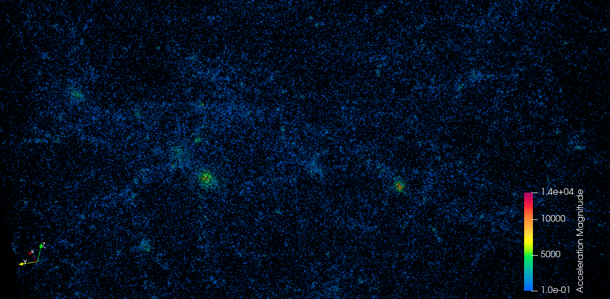
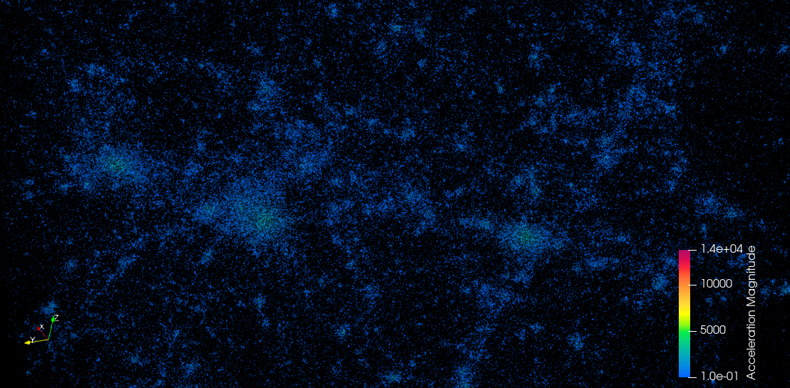
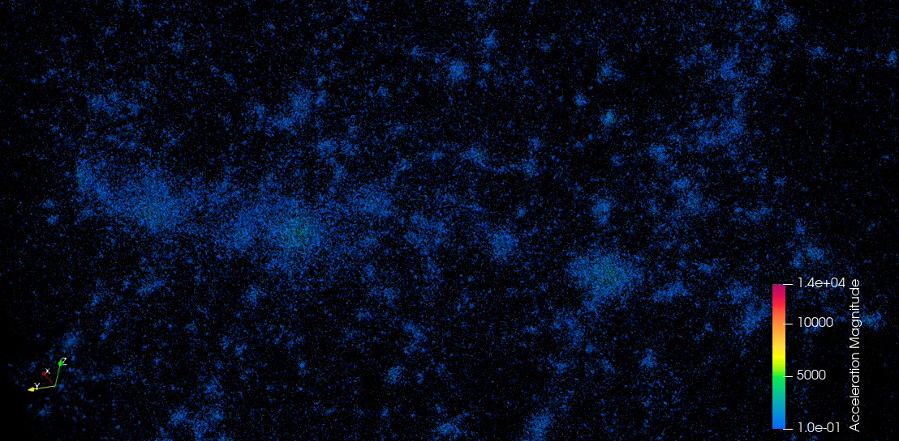
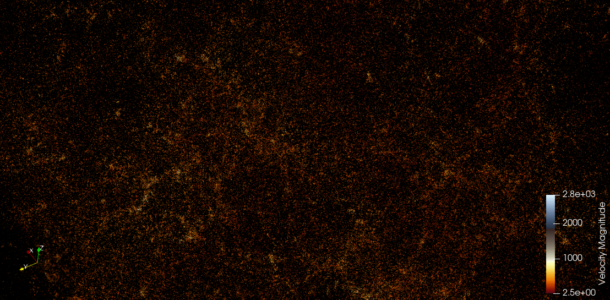
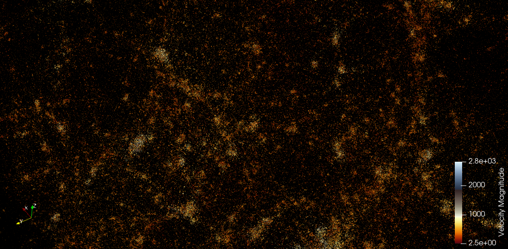
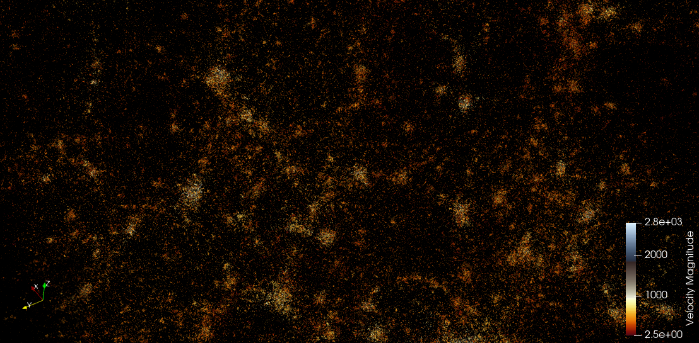

# CS6635
Final Project for CS6635

- [x] matplotlib particle_density_2d (animation + image) 
  - `./matplotlib/particle_density_2d.py`
  - `particle_density(startT, endT, animation=False, save=True, twoD=True)`
    - `time`: [0.12, 0.99]
    - `twoD`: if True, it shows the 2D scatter result; if False, it shows the 3D scatter result. (3D动画需要很长时间)
- [x] raw particles 数据转成VTK对象（position，velocity，acceleration，gravitational potential-phi）
- [ ] halo 数据转成VTK对象（haloId，time，scale）（还有点问题）

最终结果图
1. 2D Projection of Particle Density (animation)
  
2. 3D Projection of Particle Density (static)
  
3. Gravitational potential of particles Over Time
   
   
   
4. Acceleration of particles Over Time
   
   
   
5. Velocity of particles Over Time
   
   
   